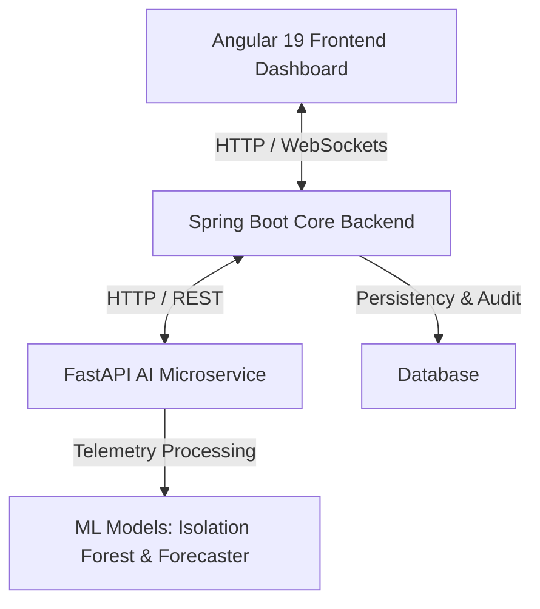

# Droppy: Water Leak Detection & Anomaly Analysis Suite

Droppy is an intelligent, multi-service IoT anomaly detection suite designed to identify water leakages and inconsistencies in pipe networks. It leverages machine learning models combined with operational rules to process sensor telemetry, trigger automated alerts, and present actionable insights on an interactive dashboard.

---

## 🏗️ System Architecture

The suite consists of three core components running in harmony:



1. **Frontend (`dashboard-angular`)**: Angular 19 SPA displaying anomalies list, leak maps, historical charts, and receiving real-time WebSocket notifications.
2. **Core Backend (`core-service`)**: Spring Boot microservice managing telemetry ingestion, scheduler pipelines, Liquibase database migrations, and real-time event routing.
3. **AI Microservice (`src`)**: FastAPI app executing data cleaner, preprocessing pipelines, rule-based heuristics (e.g. Night Flow), and ML inference (Isolation Forest/Time-series forecasting).

---

## 🛠️ Tech Stack & Key Technologies

### 1. Artificial Intelligence & Telemetry Processing (Python/FastAPI)
- **FastAPI**: High-performance async web framework for API endpoints.
- **Scikit-Learn**: Employs `Isolation Forest` for unsupervised anomaly detection.
- **Joblib**: Serializes and deserializes machine learning model states.
- **Pandas & NumPy**: For time-series cleanup, resampling, and preprocessing.

### 2. Core Backend Services (Java/Spring Boot)
- **Spring Boot 3**: REST Controller orchestration & scheduling configurations.
- **Spring WebSockets**: Real-time push notification system to notify the dashboard about critical leaks instantly.
- **Liquibase**: Database schema migration and version control.

### 3. Client Dashboard (TypeScript/Angular 19)
- **Angular 19**: Responsive client interface.
- **RxJS & WebSockets**: Handles asynchronous reactive updates for new anomalies.
- **Charting Engine**: Time-series visualization of water flows and pressure.

---

## 🚀 Getting Started & Execution

### Prerequisites
Make sure your system has the following installed:
- **Python 3.10+** (with `pip` and virtual environment support)
- **Java JDK 17+**
- **Node.js** (LTS version)

### Automated Startup (Windows)
The repository contains a helper script at the root directory: `run_app.bat`. 
Simply double-click the script or execute it in your terminal:
```cmd
.\run_app.bat
```
This batch script automatically:
1. Activates the Python virtual environment (`.venv`) and launches FastAPI on port `8001`.
2. Launches the Spring Boot backend on port `8082`.
3. Serves the Angular application on port `4200` using `ng serve`.

---

## 📂 Project Structure

```
stage/
├── core-service/          # Spring Boot Backend Core
│   ├── src/               # Java Source files
│   ├── pom.xml            # Maven Configuration
│   └── db/changelog/      # Liquibase Migrations
├── dashboard-angular/     # Angular 19 UI Dashboard
│   ├── src/               # UI components, services, routes
│   └── package.json       # Node package configurations
├── src/                   # FastAPI AI Engine
│   ├── data/              # Telemetry loading and cleaning scripts
│   ├── features/          # Feature engineering & preprocessing
│   ├── models/            # Isolation Forest & daily consumption forecasting
│   └── main.py            # FastAPI main application
├── models/                # Serialized Joblib model files
├── tests/                 # Unit tests for ML & preprocessing pipelines
├── requirements.txt       # Python environment dependencies
└── run_app.bat            # Orchestration launcher script
```

---

## 🧪 Testing & Verification

### Python AI Tests
We use `pytest` for validation. Execute from the root directory:
```bash
pytest tests/
```

### Spring Boot Backend Tests
Compile and run backend checks:
```bash
cd core-service
mvn clean test
```

### Angular Frontend Tests
Run client tests:
```bash
cd dashboard-angular
npm run test
```

---

## 📈 Main API Endpoints

- **FastAPI AI Docs**: [http://127.0.0.1:8001/docs](http://127.0.0.1:8001/docs)
  - `POST /train/{mac}`: Retrains ML models for a device.
  - `POST /predict/{mac}`: Combined anomaly predictions.
  - `GET /forecast/{mac}`: Predicts consumption trends.
- **Spring Boot API**: [http://127.0.0.1:8082/api/v1/droppy/anomalies](http://127.0.0.1:8082/api/v1/droppy/anomalies)
- **Angular App**: [http://localhost:4200](http://localhost:4200)
