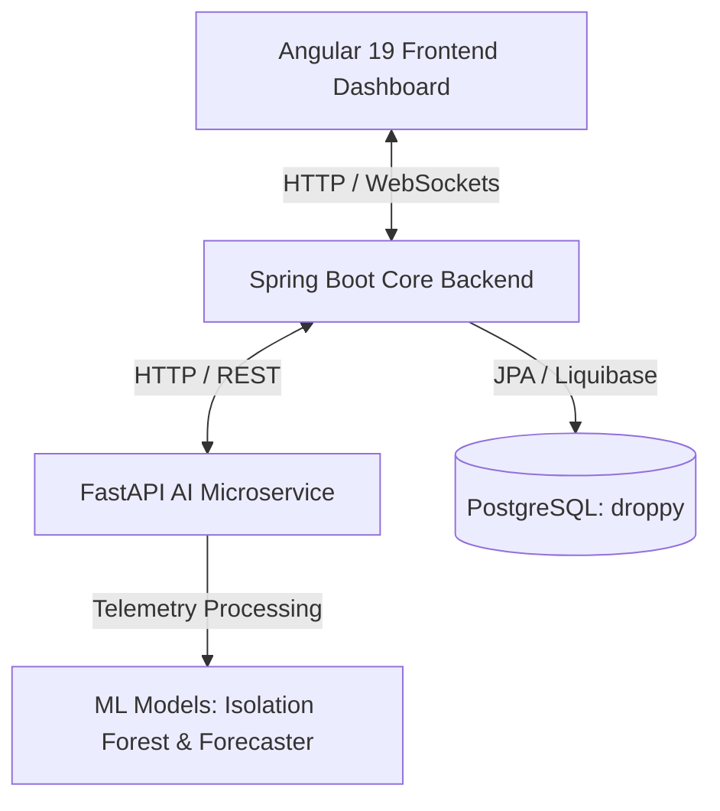

# Droppy: Water Leak Detection & Anomaly Analysis Suite

Droppy est une plateforme multi-services de supervision des réseaux d'eau. Elle combine un microservice IA Python, une API d'orchestration Spring Boot et un dashboard Angular pour détecter les anomalies de débit, les incohérences vanne/débit et les dérives de consommation.

---

## 🏗️ System Architecture

The suite consists of three core components running in harmony:



1. **Frontend (`dashboard-angular`)**: SPA Angular 19 affichant les anomalies, les cartes, les prévisions et les notifications WebSocket.
2. **Core Backend (`core-service`)**: Spring Boot 3.3 gérant l'API REST, PostgreSQL, Liquibase, le scheduler et la diffusion STOMP/WebSocket.
3. **AI Microservice (`src`)**: FastAPI exécutant le nettoyage, le feature engineering, le Minimum Night Flow, l'incohérence vanne/débit, Isolation Forest et la prévision.

---

## 🛠️ Tech Stack & Key Technologies

### 1. Artificial Intelligence & Telemetry Processing (Python/FastAPI)

- **FastAPI**: High-performance async web framework for API endpoints.
- **Scikit-Learn**: Employs `Isolation Forest` for unsupervised anomaly detection.
- **Joblib**: Serializes and deserializes machine learning model states.
- **Pandas & NumPy**: For time-series cleanup, resampling, and preprocessing.

### 2. Core Backend Services (Java/Spring Boot)

- **Spring Boot 3**: REST Controller orchestration & scheduling configurations.
- **Spring WebSockets**: Real-time push notification system to notify the dashboard about critical leaks instantly.
- **Liquibase**: Database schema migration and version control.

### 3. Client Dashboard (TypeScript/Angular 19)

- **Angular 19**: Responsive client interface.
- **RxJS & WebSockets**: Handles asynchronous reactive updates for new anomalies.
- **Charting Engine**: Time-series visualization of water flows and pressure.

---

## 🚀 Getting Started & Execution

### Prerequisites

Make sure your system has the following installed:

- **Python 3.10+** (with `pip` and virtual environment support)
- **Java JDK 17+**
- **Node.js** (LTS version)
- **PostgreSQL 15+**, running on port `5432`

### PostgreSQL setup

The active database is PostgreSQL, not in-memory H2. Create the database once:

```sql
CREATE DATABASE droppy;
```

The backend reads these variables from the environment or the root `.env` file:

```properties
DB_URL=jdbc:postgresql://localhost:5432/droppy
DB_USER=postgres
DB_PASSWORD=your_password
GEMINI_API_KEY=your_gemini_key
GEMINI_MODELS=gemini-3.6-flash,gemini-3.7-flash,gemini-3.8-flash,gemini-flash-latest
```

Never commit `.env` or expose `GEMINI_API_KEY` in Angular. Liquibase creates the schema and Spring JPA persists anomalies in PostgreSQL.

### Automated Startup (Windows)

The repository contains a helper script at the root directory: `run_app.bat`.

Simply double-click the script or execute it in your terminal:

```cmd
.\run_app.bat
```

This batch script automatically:

1. Activates the Python virtual environment (`.venv`) and launches FastAPI on port `8001`.
2. Launches the Spring Boot backend on port `8082`.
3. Serves the Angular application on port `4200` using `ng serve`.

For manual startup, use three terminals from the repository root:

```powershell
# Terminal 1
.\.venv\Scripts\Activate.ps1
uvicorn src.main:app --host 127.0.0.1 --port 8001

# Terminal 2
Set-Location core-service
..\.mvn-bin\apache-maven-3.9.6\bin\mvn.cmd spring-boot:run

# Terminal 3
Set-Location dashboard-angular
npm install
npm start
```

---

## 📂 Project Structure

```text
stage/
├── core-service/          # Spring Boot Backend Core
│   ├── src/               # Java Source files
│   ├── pom.xml            # Maven Configuration
│   └── db/changelog/      # Liquibase Migrations
├── dashboard-angular/     # Angular 19 UI Dashboard
│   ├── src/               # UI components, services, routes
│   └── package.json       # Node package configurations
├── src/                   # FastAPI AI Engine
│   ├── data/              # Telemetry loading and cleaning scripts
│   ├── features/          # Feature engineering & preprocessing
│   ├── models/            # Isolation Forest & daily consumption forecasting
│   └── main.py            # FastAPI main application
├── models/                # Serialized Joblib model files
├── tests/                 # Unit tests for ML & preprocessing pipelines
├── requirements.txt       # Python environment dependencies
└── run_app.bat            # Orchestration launcher script
```

---

## 🧪 Testing & Verification

### Python AI Tests

We use `pytest` for validation. Execute from the root directory:

```powershell
pytest tests/
```

### Spring Boot Backend Tests

Compile and run backend checks:

```powershell
Set-Location core-service
..\.mvn-bin\apache-maven-3.9.6\bin\mvn.cmd clean test
```

### Angular Frontend Tests

Run client tests:

```powershell
Set-Location dashboard-angular
npm run test
```

---

## 📈 Main API Endpoints

- **FastAPI AI Docs**: [http://127.0.0.1:8001/docs](http://127.0.0.1:8001/docs)
  - `GET /health`: Health check.
  - `POST /train/{mac}`: Retrains ML models for a device.
  - `POST /predict/{mac}?from=...&to=...`: Combined anomaly predictions.
  - `GET /forecast/{mac}`: Predicts consumption trends.
- **Spring Boot API**: [http://127.0.0.1:8082/api/v1/droppy/anomalies](http://127.0.0.1:8082/api/v1/droppy/anomalies)
- **Spring Boot Swagger**: [http://localhost:8082/swagger-ui/index.html](http://localhost:8082/swagger-ui/index.html)
- **Chatbot**: `POST http://localhost:8082/api/v1/droppy/chat`
- **Angular App**: [http://localhost:4200](http://localhost:4200)

## Current Gemini behavior

The API key remains server-side in Spring Boot. The chat service tries the configured models sequentially, retries transient `429` and `503` responses, tolerates network timeouts, and returns a French user-friendly message when Gemini is temporarily unavailable. Provider error payloads are kept in backend logs and are not shown in the dashboard.
